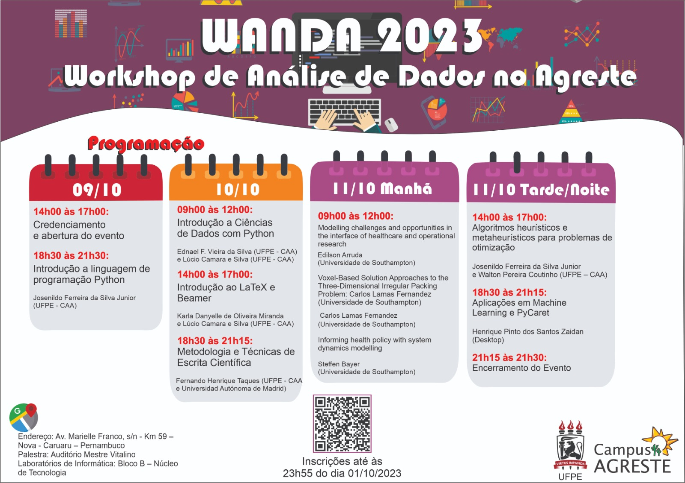

# WANDA2033
Nos dias 09/10/2023 à 11/10/2023, realizou o Workshop de Análise de Dados no Agreste (WANDA), na Universidade Federal de Pernambuco - Campus Agreste, 
onde foram apresentados os temas presentes no banner a seguir:

### Introdução a Ciência de Dados com Python

Neste repositório, tem-se o notebook utilizado para ministração da aula de Introdução a Ciência de Dados com Python, de minha autoria. Espero que todos
que visualizem, possam extrair informações e insights úteis para seu aprendizado.
